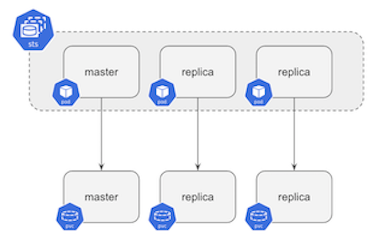

# TimescaleDB Classic

This directory contains a Helm chart to deploy a three
node [TimescaleDB](https://github.com/timescale/timescaledb/) cluster in a
High Availability (HA) configuration on Kubernetes. This chart will do the following:

- Create three (by default) pods using a Kubernetes [StatefulSet](https://kubernetes.io/docs/concepts/workloads/controllers/statefulset/).
- Each pod is created using the [TimescaleDB HA Docker image](https://github.com/timescale/timescaledb-docker-ha).
- Each pod runs a TimescaleDB instance and Patroni agent.
- Each TimescaleDB instance is configured for replication (1 Master + 2 Replicas).

> When deploying on AWS EKS, the pods will be scheduled on nodes which run in different Availability Zones (AZs).
As well, an AWS Elastic Load Balancer (ELB) is configured to handle routing incoming traffic to the Master pod.

{:height="500px"}


## Installing

To install the chart with the release name `my-release`:

```
helm install --name my-release .
```

To install the chart with randomly generated passwords:

```
helm install --name my-release . \
  --set credentials.superuser="$(< /dev/urandom tr -dc _A-Z-a-z-0-9 | head -c32)",credentials.admin="$(< /dev/urandom tr -dc _A-Z-a-z-0-9 | head -c32)",credentials.standby="$(< /dev/urandom tr -dc _A-Z-a-z-0-9 | head -c32)"
```

## Custom Configuration

The following table lists the configurable parameters of the TimescaleDB Helm chart and their default values.

|       Parameter                   |           Description                       |                         Default                     |
|-----------------------------------|---------------------------------------------|-----------------------------------------------------|
| `nameOverride`                    | Override the name of the chart              | `timescaledb`                                       |
| `fullnameOverride`                | Override the fullname of the chart          | `nil`                                               |
| `replicaCount`                    | Amount of pods to spawn                     | `3`                                                 |
| `image.repository`                | The image to pull                           | `timescaledev/timescaledb-ha`                       |
| `image.tag`                       | The version of the image to pull            | `78603166-pg11`                                     |
| `image.pullPolicy`                | The pull policy                             | `IfNotPresent`                                      |
| `credentials.superuser`           | Password of the superuser                   | `tea`                                               |
| `credentials.admin`               | Password of the admin                       | `cola`                                              |
| `credentials.standby`             | Password of the replication user            | `pinacolada`                                        |
| `kubernetes.dcs.enable`           | Using Kubernetes as DCS                     | `true`                                              |
| `kubernetes.configmaps.enable`    | Using Kubernetes configmaps instead of endpoints | `false`                                        |
| `env`                             | Extra custom environment variables          | `{}`                                                |
| `resources`                       | Any resources you wish to assign to the pod | `{}`                                                |
| `nodeSelector`                    | Node label to use for scheduling            | `{}`                                                |
| `tolerations`                     | List of node taints to tolerate             | `[]`                                                |
| `affinityTemplate`                | A template string to use to generate the affinity settings | Anti-affinity preferred on hostname  |
| `affinity`                        | Affinity settings. Overrides `affinityTemplate` if set. | `{}`                                    |
| `schedulerName`                   | Alternate scheduler name                    | `nil`                                               |
| `persistentVolume.accessModes`    | Persistent Volume access modes              | `[ReadWriteOnce]`                                   |
| `persistentVolume.annotations`    | Annotations for Persistent Volume Claim`    | `{}`                                                |
| `persistentVolume.mountPath`      | Persistent Volume mount root path           | `/home/postgres/pgdata`                             |
| `persistentVolume.size`           | Persistent Volume size                      | `2Gi`                                               |
| `persistentVolume.storageClass`   | Persistent Volume Storage Class             | `volume.alpha.kubernetes.io/storage-class: default` |
| `persistentVolume.subPath`        | Subdirectory of Persistent Volume to mount  | `""`                                                |
| `rbac.create`                     | Create required role and rolebindings       | `true`                                              |
| `serviceAccount.create`           | If true, create a new service account	      | `true`                                              |
| `serviceAccount.name`             | Service account to be used. If not set and `serviceAccount.create` is `true`, a name is generated using the fullname template | `nil` |

Specify each parameter using the `--set key=value[,key=value]` argument to `helm install`.

Alternatively, a YAML file that specifies the values for the parameters can be provided while installing the chart. For example,

```
helm install --name my-release -f values.yaml .
```

> **Tip**: You can use the default [values.yaml](values.yaml)

## Resources

To list the Kubernetes resources created:

```
kubectl get all -l release=my-release
```

```
NAME                        READY   STATUS              RESTARTS   AGE
pod/example-timescaledb-0   1/1     Running             0          79s
pod/example-timescaledb-1   1/1     Running             0          53s
pod/example-timescaledb-2   1/1     Running             0          23s


NAME                                 TYPE           CLUSTER-IP      EXTERNAL-IP                PORT(S)          AGE
service/my-release-timescaledb          LoadBalancer   10.100.157.80   verylongname.example.com   5432:32641/TCP   79s
service/my-release-timescaledb-config   ClusterIP      None            <none>                     <none>           53s

NAME                                   READY   AGE
statefulset.apps/my-release-timescaledb   3/3     80s
```


## Replication

TimescaleDB is built on top of PostgreSQL. To ensure a high-availability configuration,
[Patroni](https://github.com/zalando/patroni) is used. Patroni is responsible for electing
a PostgreSQL master pod. After election, Patroni adds a `spilo-role=master` label to the elected master and set the label
to `spilo-role=replica` for all replicas. Simultaneously it will
update the `<release-name>-timescaledb` endpoint to let the service route traffic to the elected master.

```console
$ kubectl get pods -l spilo-role -L spilo-role
NAME                       READY   STATUS    RESTARTS   AGE     SPILO-ROLE
my-release-timescaledb-0   1/1     Running   0          9m10s   master
my-release-timescaledb-1   1/1     Running   0          8m40s   replica
my-release-timescaledb-2   1/1     Running   0          8m5s    replica
```


## Cleanup

To remove the spawned pods you can run a simple `helm delete <release-name>`.

Helm will however preserve created persistent volume claims. To also remove the persistent
volumes, execute the commands below.

```
release=my-release
helm delete my-release
kubectl delete pvc -l release=my-release
```

## Connecting to TimescaleDB

By default, the `postgres` password is set in `values.yaml`:

```yaml
credentials:
  superuser: tea
```

Using the External IP for the service (which will route thru the LoadBalancer to the Master), you
can connect via `psql` using the following:

```bash
psql -h verylongname.example.com -U postgres
```
```
Password for user postgres: 

postgres=#
```

From here, you can start creating users and databases, for example, using the above `psql` session:
```sql
CREATE USER example WITH PASSWORD 'thisIsInsecure';
CREATE DATABASE example OWNER example;
-- Installing TimescaleDB should be done by a superuser, so we connect to the new db and install it
\connect example postgres
CREATE EXTENSION timescaledb;
\q
```

Connect to the example database with the example user:

```bash
psql -h verylongname.example.com -U example -d example
```

This should get you into the example database, from here on you can follow
our [TimescaleDB > Getting Started](https://docs.timescale.com/latest/getting-started/creating-hypertables) to create hypertables
and start using TimescaleDB.

### Connecting from inside the Cluster

To access the database from inside the cluster, spin up another Pod to run `psql`:

```
kubectl run -i --tty --rm psql --image=postgres --restart=Never -- bash -il
```

Then, from inside the pod, connect to PostgreSQL:

```console
$ psql -U admin -h my-release-timescaledb.default.svc.cluster.local postgres
<admin password from values.yaml>
postgres=>
```


