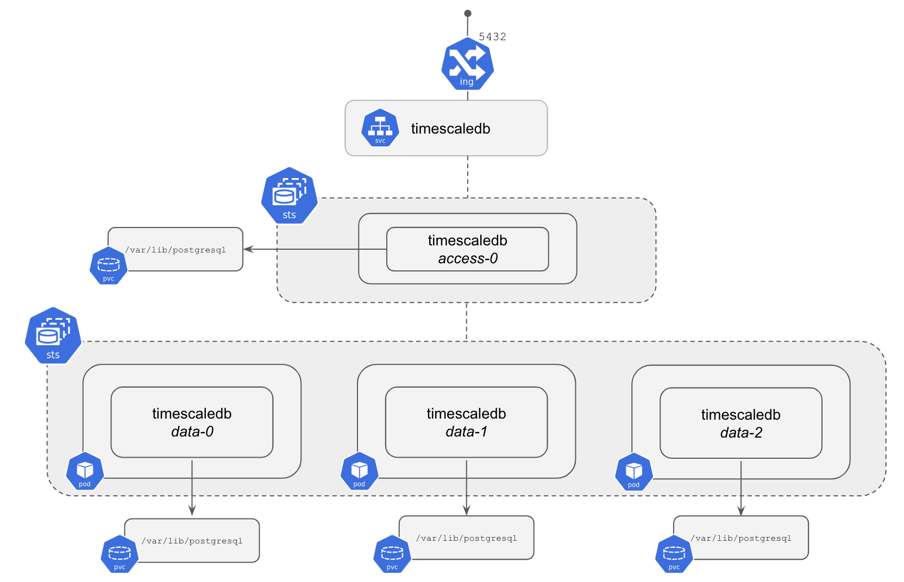

<!---
This file and its contents are licensed under the Apache License 2.0.
Please see the included NOTICE for copyright information and LICENSE for a copy of the license.
-->

# TimescaleDB Multinode

This directory contains a Helm chart to deploy a multinode [TimescaleDB](https://github.com/timescale/timescaledb/) cluster.
This chart will do the following:

- Creates a single TimescaleDB **Access Node** using a Kubernetes [StatefulSet](https://kubernetes.io/docs/concepts/workloads/controllers/statefulset/).
- Creates multiple pods (by default 3) containing **Data Nodes** using another Kubernetes StatefulSet
- Each pod has a container created using a Docker image which includes the TimescaleDB multinode sources



When deploying on AWS EKS:
- An AWS Elastic Load Balancer (ELB) is configured to handle routing incoming traffic to the Access Node.

## Installing

To install the chart as a release and name it `my-release`:

```console
helm install --name my-release .
```

You can override parameters using the `--set key=value[,key=value]` argument to `helm install`,
e.g., to install the chart with randomly generated passwords:

```console
random_password () { < /dev/urandom tr -dc _A-Z-a-z-0-9 | head -c32; }
helm install --name my-release . \
    --set credentials.accessNode.superuser="$(random_password)"
```

Alternatively, a YAML file that specifies the values for the parameters can be provided while installing the chart. For example,
```console
helm install --name my-release -f myvalues.yaml .
```

For details about what parameters you can set, have a look at the [Administrator Guide](admin-guide.md#configure)

## Using a local image

During development, it is practical to be able to use a locally built image of TimescaleDB multinode without having to push it to a registry. This can be done as follows:

```console
# Setup the environment to use Minikube's Docker daemon
eval $(minikube docker-env)

# Build a new image (this requires being in the TimescaleDB source directory):
IMAGE_NAME=mytsdb TAG_NAME=build-1 ../scripts/docker-build.sh
```
If you don't specify an image name and tag name, like above, make note of the name and the tag of the new image that gets built. Then launch multinode TimescaleDB using the new image:

```console
helm install --name my-release --set image.repository=mytsdb --set image.tag=build-1 .
```

## Connecting to TimescaleDBs

Once the multinode deployment of TimescaleDB is running, you can connect to the access node:

```console
kubectl exec -it my-release-timescaledb-access-0 -- psql -U postgres
```

### Connecting from outside Kubernetes
If you want to connect directly to the access node, without going
through Kubernetes, you need to know the host (and port) to connect
to. Use `kubectl` to get that information:

```console
kubectl get service/my-release-timescaledb
```
```
NAME                             TYPE           CLUSTER-IP      EXTERNAL-IP                PORT(S)          AGE
service/my-release-timescaledb   LoadBalancer   10.100.157.80   verylongname.example.com   5432:32641/TCP   79s
```

Using the External IP for the service (which will route through the
LoadBalancer to the Access Node), you can connect via `psql` using the
following (default example superuser password is `tea`)

```console
psql -h verylongname.example.com -U postgres
```
```
Password for user postgres:
postgres=#
```

From here, you can start creating users and databases, for example, using the above `psql` session:
```sql
CREATE USER example WITH PASSWORD 'thisIsInsecure';
CREATE DATABASE example OWNER example;
```

Connect to the example database with the example user:

```console
psql -h verylongname.example.com -U example -d example
```

This should get you into the example database, from here on you can follow
our [TimescaleDB > Tutorial: Scaling out TimescaleDB](https://docs.timescale.com/clustering/tutorials/clustering)
to create distributed hypertables and start using multinode TimescaleDB.

### Connecting from another pod

From inside a pod in the Kubernetes cluster, you need to use the
internal DNS address, e.g.,
`my-release-timescaledb.default.svc.cluster.local`. For instance,
let's run a new pod where we can run the PostgreSQL client:

```console
kubectl run -i --tty --rm psql --image=postgres --restart=Never -- bash -il
```

Then from within the Pod, connect to the access node:

```console
$ psql -U postgres -h my-release-timescaledb.default.svc.cluster.local postgres
```

provide the password `tea` followed by "Enter".

## Cleanup

To remove the spawned pods you can run a simple
```console
helm delete my-release --purge
```
Some items, (pvc's for example) are not immediately removed.
To also purge these items, have a look at the [Administrator Guide](admin-guide.md#cleanup)

## Further reading

- [Administrator Guide](admin-guide.md)
- [TimescaleDB Documentation](https://docs.timescale.com/clustering/main)
