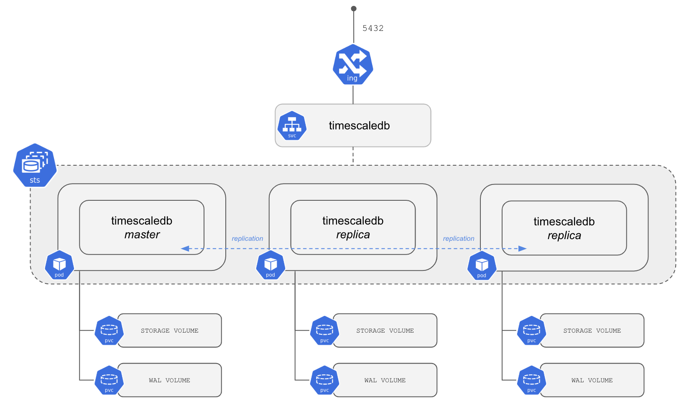
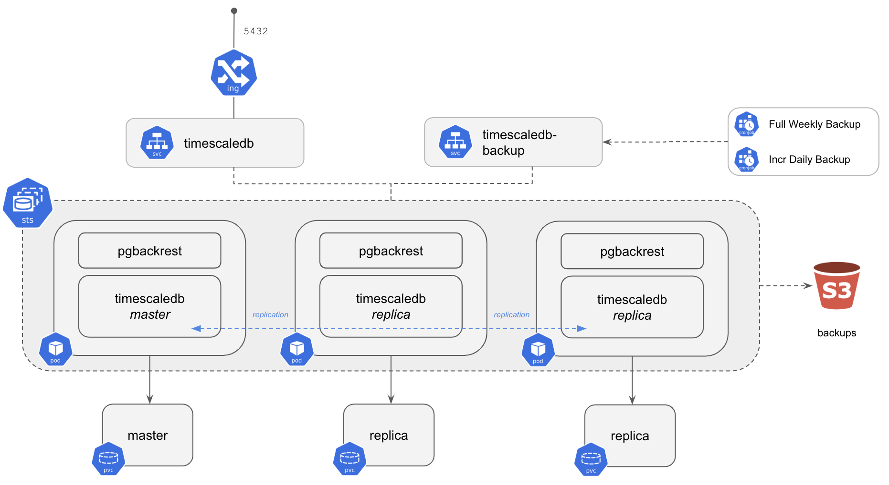

<!---
This file and its contents are licensed under the Apache License 2.0.
Please see the included NOTICE for copyright information and LICENSE for a copy of the license.
-->

# TimescaleDB Single

##### Table of Contents
- [Introduction](#introduction)
- [Installing](#installing)
  - [Installing from the Timescale Helm Repo](#installing-from-the-timescale-helm-repo)
- [Connecting to TimescaleDBs](#connecting-to-timescaledbs)
  - [Connecting from inside the Cluster](#connecting-from-inside-the-cluster)
- [Create backups](#create-backups)
- [Cleanup](#cleanup)
- [Further reading](#further-reading)

## Introduction
This directory contains a Helm chart to deploy a three
node [TimescaleDB](https://github.com/timescale/timescaledb/) cluster in a
High Availability (HA) configuration on Kubernetes. This chart will do the following:

- Creates three (by default) pods using a Kubernetes [StatefulSet](https://kubernetes.io/docs/concepts/workloads/controllers/statefulset/).
- Each pod has a container created using the [TimescaleDB Docker image](https://github.com/timescale/timescaledb-docker-ha).
  - TimescaleDB 2.1 and PG 13
- Each of the containers runs a TimescaleDB instance and [Patroni](https://patroni.readthedocs.io/en/latest/) agent.
- Each TimescaleDB instance is configured for replication (1 Master + 2 Replicas).



When deploying on AWS EKS:
- The pods will be scheduled on nodes which run in different Availability Zones (AZs).
- An AWS Elastic Load Balancer (ELB) is configured to handle routing incoming traffic to the Master pod.

When configured for Backups to S3:
- Each pod will also include a container running [pgBackRest](https://pgbackrest.org/).
- By default, two [CronJobs](https://kubernetes.io/docs/concepts/workloads/controllers/cron-jobs/) are created to handle full weekly and incremental daily backups.
- The backups are stored to an S3 bucket.




## Installing

To install the chart with the release name `my-release`, first  in `values.yaml` you need to set credentials mentioned in list
below. If you decide not to set those credentials, they will be randomly generated. Those credentials can be setup via helm only
during helm first run and they won't be rotated with subsequent helm update commands to prevent breaking the database.

* The credentials for the superuser, admin and stand-by users
* TLS Certificates
* pgbackrest config (optional)

Then you can install the chart with:
```console
helm install --name my-release charts/timescaledb-single
```

You can override parameters using the `--set key=value[,key=value]` argument to `helm install`,
e.g., to install the chart with backup enabled:

```console
helm install --name my-release charts/timescaledb-single --set backup.enabled=true
```

Alternatively, a YAML file that specifies the values for the parameters can be provided while installing the chart. For example,
```console
helm install --name my-release -f myvalues.yaml charts/timescaledb-single
```

For details about what parameters you can set, have a look at the [Administrator Guide](docs/admin-guide.md#configure)

### Installing from the Timescale Helm Repo

We have a Helm Repository that you can use, instead of cloning this Git repo.

First add the repository with:
```console
helm repo add timescale 'https://charts.timescale.com'
```
> **NOTICE**: Helm chart installation will randomly generate secrets which cannot be rotated with subsequent helm upgrades.
If you want to use predefined credentials, please set them in `secrets` section of `values.yaml` before running `helm install`.

Next proceed to install the chart:

```console
helm install my-release .
```

To keep the repo up to date with new versions you can do:
```console
helm repo update
```
## Connecting to TimescaleDBs

To connect to the TimescaleDB instance, we first need to know to which host we need to connect. Use `kubectl` to get that information:
```console
kubectl get service/my-release
```
```
NAME         TYPE           CLUSTER-IP       EXTERNAL-IP                 PORT(S)          AGE
my-release   LoadBalancer   10.100.149.189    verylongname.example.com   5432:31294/TCP   27s
```

Using the External IP for the service (which will route through the LoadBalancer to the Master), you
can connect via `psql` using the superuser `postgres` by:
* decoding the password you generated with kustomize
```console
PGPOSTGRESPASSWORD=$(kubectl get secret --namespace default my-release-credentials -o jsonpath="{.data.PATRONI_SUPERUSER_PASSWORD}" | base64 --decode)
```
* Connecting with psql
```console
PGPASSWORD=$PGPOSTGRESPASSWORD psql -h verylongname.example.com -U postgres
```

> NOTICE: You may have to wait a few minutes before you can resolve the DNS record

From here, you can start creating users and databases, for example, using the above `psql` session:
```sql
CREATE USER example WITH PASSWORD 'thisIsInsecure';
CREATE DATABASE example OWNER example;
```

Connect to the example database with the example user:

```console
psql -h verylongname.example.com -U example -d example
```

This should get you into the example database, from here on you can follow
our [TimescaleDB > Getting Started](https://docs.timescale.com/latest/getting-started/creating-hypertables) to create hypertables
and start using TimescaleDB.

### Connecting from inside the Cluster

To access the database from inside the cluster, you can run `psql` inside the Pod containing the primary:

```
RELEASE=my-release
kubectl exec -ti $(kubectl get pod -o name -l role=master,release=$RELEASE) psql
```

## Create backups
The backup is disabled by default, look at the

[Administrator Guide](docs/admin-guide.md#backups) on how to configure backup location, credentials, schedules, etc.

## Cleanup

To remove the spawned pods you can run a simple
```console
helm delete my-release
```
Some items, (pvc's and S3 backups for example) are not immediately removed.
To also purge these items, have a look at the [Administrator Guide](docs/admin-guide.md#cleanup)

## Further reading

- [Administrator Guide](docs/admin-guide.md)
- [TimescaleDB Documentation](https://docs.timescale.com/latest/main)
